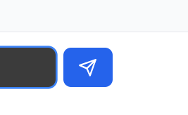
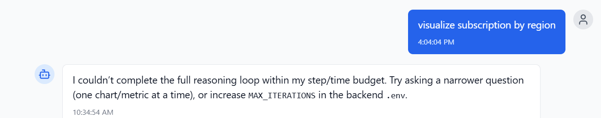

# Backend Architecture Flow - AI Data Analyst

This document details the end-to-end flow of the AI Data Analyst backend architecture, explaining how data moves from the user to the LLM and back.

## 1. High-Level Overview

The backend is built with **FastAPI** and follows a modular architecture. It serves as the bridge between the frontend, the database, the file system, and the LLM providers (OpenAI or Company GenAI).

**Core Components:**
1.  **API Layer (`app/api/`)**: Handles HTTP requests (Uploads, Chat, Analysis).
2.  **Agent Layer (`app/agents/`)**: Orchestrates the "thinking" process using LangChain.
3.  **Core Layer (`app/core/`)**: Configuration, database connection, and security.
4.  **Utils Layer (`app/utils/`)**: Helper functions for code execution, chart generation, and LLM integration.
5.  **Database Layer (`app/models/`, `app/schemas/`)**: SQLAlchemy models and Pydantic schemas.

---

## TODO
- [ ] force kill option 
 

- [ ] up or down arrow to go previous query
- [ ] bussiness error showing at the end user
 
- [ ] chart not generating properly
 

## 2. Detailed Data Flow

### A. Application Startup (`main.py`)
1.  **Initialization**: `FastAPI` app is created.
2.  **Database**: `models.Base.metadata.create_all(bind=engine)` creates tables in PostgreSQL if they don't exist.
3.  **Middleware**: CORS is configured to allow frontend requests.
4.  **Routers**: `chat`, `files`, and `analysis` routers are included.

### B. File Upload Flow (`app/api/files.py`)
**Goal**: User uploads a CSV/Excel file for analysis.

1.  **Request**: `POST /api/files/upload` with the file.
2.  **Validation**:
    *   Check extension (allowed: .csv, .xlsx, .xls).
    *   Check size (max: 10MB).
    *   **TODO**: In future max should be 500MB.
3.  **Storage**:
    *   File is saved to `uploads/` directory with a unique UUID filename.
    *   **TODO**: In production, this should be S3/Azure Blob Storage.
4.  **Metadata Extraction**:
    * **TODO**: Preprocessing of data need to be done

    *   Pandas reads the file (`pd.read_csv` / `pd.read_excel`).
    *   Column names and data types are extracted.
5.  **Database Entry**: A record is created in `uploaded_files` table with path, size, row count, and column info.
6.  **Response**: Returns file ID and metadata to frontend.

### C. Chat/Analysis Flow (`app/api/chat.py` & `app/agents/data_analyst.py`)
**Goal**: User asks "What is the total revenue?"

1.  **Request**: `POST /api/chat/message` with `session_id`, `message`, and `file_id`.
2.  **Session Management**:
    *   Checks if `Conversation` exists for `session_id`. If not, creates one.
    *   Links conversation to the uploaded file.
3.  **Data Loading**:
    *   **TODO** load data better and check any scope of improvement
    *   Retrieves file path from database using `file_id`.
    *   Loads data into a Pandas DataFrame (`df`).
4.  **Agent Initialization (`DataAnalystAgent`)**:
    *   **LLM Setup**: Initializes `ChatOpenAI` or `CompanyGenAILLM` based on config.
    *   **Memory**: Loads past chat history from database into `ConversationBufferMemory`.
    *   **Tools**: Creates tools for the LLM:
        *   `get_dataframe_info`: Returns `df.info()` and `df.head()`.
        *   `execute_pandas_code`: Runs Python code on the dataframe.
        *   `analyze_column`: Gets stats for a specific column.
5.  **Reasoning Loop (ReAct Pattern)**:
    *   **Input**: "What is the total revenue?"
    *   **Thought 1**: LLM decides it needs to see the dataframe structure.
    *   **Action 1**: Calls `get_dataframe_info`.
    *   **Observation 1**: Sees columns `['Revenue', 'Date', 'Product']`.
    *   **Thought 2**: LLM decides to sum the 'Revenue' column.
    *   **Action 2**: Calls `execute_pandas_code` with `df['Revenue'].sum()`.
    *   **Execution (`app/utils/code_executor.py`)**:
        *   Uses `RestrictedPython` to safely run the code.
        *   Returns the result (e.g., `1,500,000`).
    *   **Observation 2**: `1,500,000`.
    *   **Final Answer**: "The total revenue is 1,500,000."
6.  **Response Storage**:
    *   User message saved to `messages` table.
    *   Assistant response (answer, generated code, chart data) saved to `messages` table.
7.  **API Response**: Returns the answer, code, and any charts to the frontend.

### D. Code Execution Safety (`app/utils/code_executor.py`)
**Goal**: Prevent malicious code execution (e.g., `import os; os.system('rm -rf /')`).

1.  **RestrictedPython**: Used to compile code in a restricted mode.
2.  **Guards**:
    *   `safe_builtins`: Only allows safe functions (len, sum, etc.).
    *   `dangerous_keywords`: Explicitly blocks `import os`, `exec`, `eval`, etc.
3.  **Scope**: Code only has access to `df` (DataFrame), `pd` (Pandas), and `json`.

### E. Custom LLM Integration (`app/utils/custom_llm.py`)
**Goal**: Use Company's internal GenAI API instead of OpenAI.

1.  **Wrapper**: `CompanyGenAILLM` class inherits from LangChain's `BaseChatModel`.
2.  **Translation**: Converts LangChain message format (System/Human/AI) to Company API JSON format.
3.  **Authentication**: Adds `x-msi-genai-api-key` headers.
4.  **Execution**: Sends HTTP POST to company gateway and parses the response back to LangChain format.

---

## 3. Key Database Models (`app/models/models.py`)

*   **UploadedFile**: Stores file metadata (path, columns, size).
*   **Conversation**: Tracks chat sessions (linked to a file).
*   **Message**: Stores individual chat messages (User/Assistant), including generated code and charts.
*   **AnalysisResult**: Stores results of single-shot analysis queries (for non-chat mode).

---

## 4. Configuration (`app/core/config.py`)

*   **Environment Variables**: Loaded from `.env`.
*   **Settings**:
    *   `LLM_PROVIDER`: Switches between "openai" and "company".
    *   `DATABASE_URL`: PostgreSQL connection string.
    *   `UPLOAD_DIR`: Where files are stored.

---

## 5. Future Improvements (Schema-First Architecture)

The current flow loads the **entire DataFrame** into memory for every request. For large datasets (100k+ rows), this is inefficient.

**New Flow (Implemented in v2):**
1.  **Data Passport**: Extract *only* schema and stats (metadata) from the file.
2.  **Vector Store**: Store column descriptions in ChromaDB.
3.  **LLM Input**: Send only the schema + relevant columns (found via RAG) to the LLM.
4.  **Code Generation**: LLM writes code based on schema.
5.  **Execution**: Code runs on the full dataset locally (or on a spark cluster), but the LLM never sees the raw rows.
